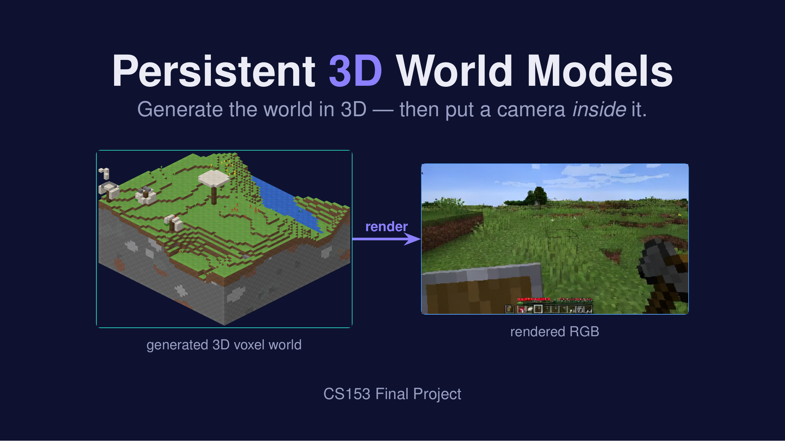
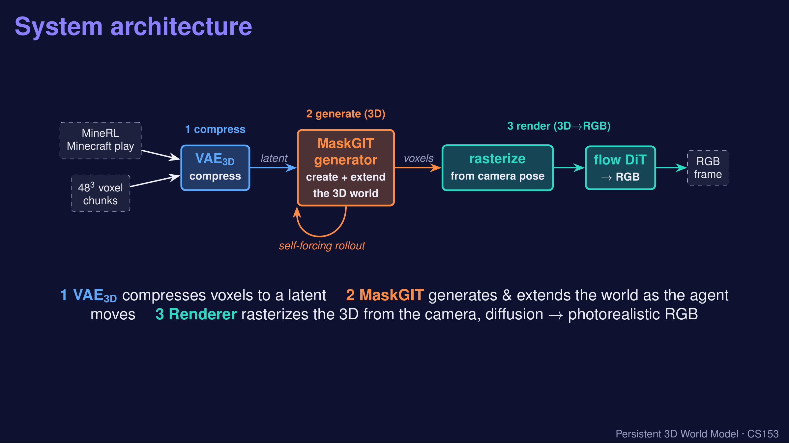
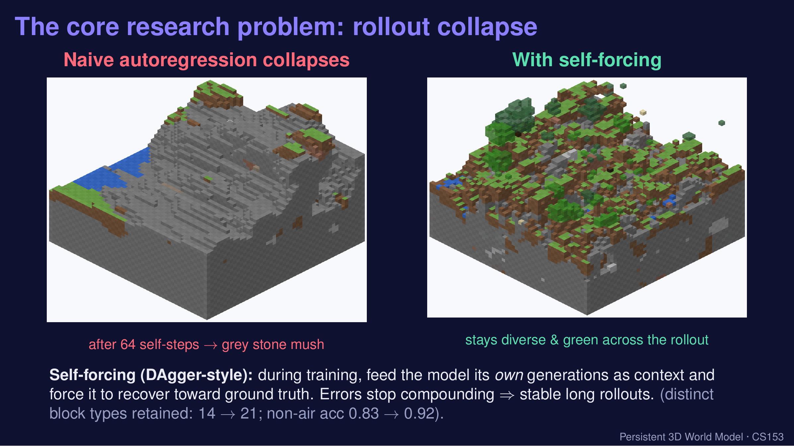
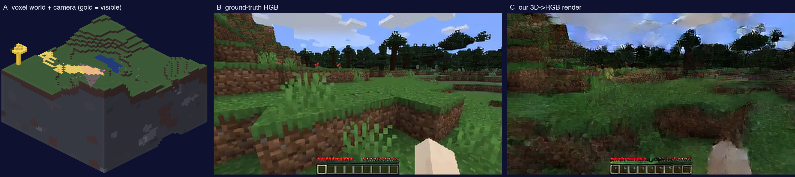
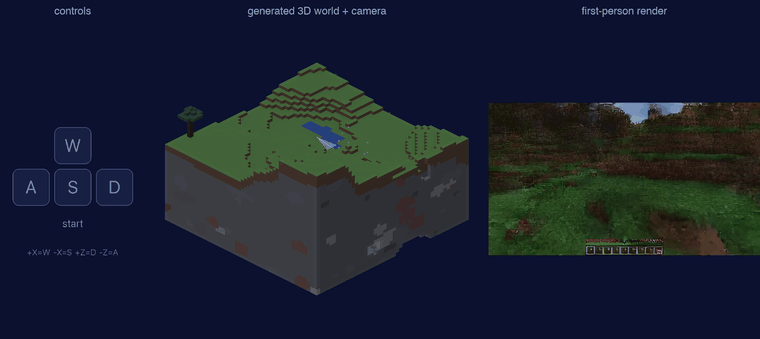

# Persistent 3D World Models

**Beyond pixel histories — generate the world in 3D, then put a camera inside it.**

Most "world models" (Oasis, Genie) generate **2D pixels** frame-by-frame, so there is no world underneath — only a video. Look away and back, and that region is re-hallucinated, different every time. This project takes the opposite approach: **generate a real 3D voxel world, then render RGB from a camera placed inside it.** Persistence is then free — the geometry is literally stored.



---

## TL;DR

- **A 3D VAE** compresses 48³ Minecraft voxel chunks into a compact latent.
- **A 3D MaskGIT generator** creates and extends the voxel world as an agent moves.
- **A rectified-flow renderer** rasterizes the voxels from the camera pose and turns them into photorealistic RGB.
- Trained on VPT / MineRL *treechop* human-play data; runs on H100s via Slurm.

---

## The system



1. **VAE₃D** (`generator/vae_3d.py`) — 48³ voxels → latent.
2. **MaskGIT generator** (`generator/voxel_maskgit.py`) — autoregressively generates / extends the 3D world (world-shift + frontier fill).
3. **Renderer** (`renderer/renderer_flow.py` + `renderer/renderer_explicit.py`) — rasterize the 3D from the camera, then a rectified-flow DiT → RGB.

---

## The core research result: fixing rollout collapse

Naive autoregression **collapses** — running the generator on its own output for many steps compounds errors until the world degenerates into grey stone. The fix is **self-forcing** (DAgger-style): during training, feed the model its own generations and force it to recover toward ground truth.



With self-forcing the rollout stays diverse across a full 64-frame horizon (distinct block types retained 14 → 21; non-air accuracy 0.83 → 0.92).

---

## The renderer is ground-truth quality

Camera placed *inside* the generated 3D world; **gold** voxels = what the camera can see. Middle is ground truth, right is our render — they match to within ~1% on high-frequency detail.



---

## Persistence demo

One model-generated 3D world. The agent walks **15 blocks out and back in every direction** (WASD tracks the motion). Every time it returns to center the world is **100% bit-identical** — a generated world that *remembers* what it generated.



---

## Repo layout

```
generator/   3D VAE, MaskGIT model, self-forcing + Stage-C (temporal) trainers, eval, vocab
renderer/    rectified-flow renderer + rasterizer, render trainers, validation
viz/         isometric voxel renderer + the camera-visibility / persistence-demo tooling
slurm/       Slurm launchers (nvcr.io pytorch container, single-node ≤8 GPU)
slides/      final presentation (PDF + PPTX)
assets/      figures used in this README
```

Key files:
- `generator/train_v14_sf.py` — self-forcing generator trainer (the one that fixes collapse).
- `generator/train_v14_stageC.py` — temporal long-horizon (up to 64-frame) self-forcing.
- `generator/eval_v14.py` — autoregressive rollout / evaluation.
- `renderer/renderer_flow.py`, `renderer/train_render_v3.py` — flow renderer + training.
- `viz/gen_persist_rollout.py`, `viz/build_persist_demo.py`, `viz/panel_a.py` — the persistence demo.

---

## Running

Training/eval run inside the `nvcr.io#nvidia/pytorch:24.12-py3` container via Slurm (single node, ≤8 GPU):

```bash
# build the voxel vocabulary
sbatch slurm/run_buildvocab.sbatch
# train the self-forcing generator
sbatch slurm/run_tcgen2.sbatch          # generator (slab-mask self-forcing)
sbatch slurm/run_stageC.sbatch          # temporal long-horizon self-forcing
# train the renderer
sbatch slurm/run_render_v3.sbatch
# roll out + evaluate
python generator/eval_v14.py --ckpt <ckpt> --out <dir> --temp 0.6 --long 64
```

(Set `V12_VOXEL_LAT_DIR`, `V12_JSONL_DIR`, `V14_VOCAB`, `VOX_VAE`, Wan VAE paths as in the Slurm scripts.)

---

## Notes & honesty

- **Model weights are not in the repo** (VAE / generator / renderer checkpoints are hundreds of MB) — available on request.
- The persistence demo uses a **lossless persistent canvas**: the generator fills the world once, then traversal is integer slicing, so return-to-center is exact. Freshly-generated frontier is sparser than the seed center (real model behavior, shown as-is).
- Data is *treechop* (grass / dirt / stone / sparse trees + water), so generated terrain matches that distribution.

CS153 final project.
